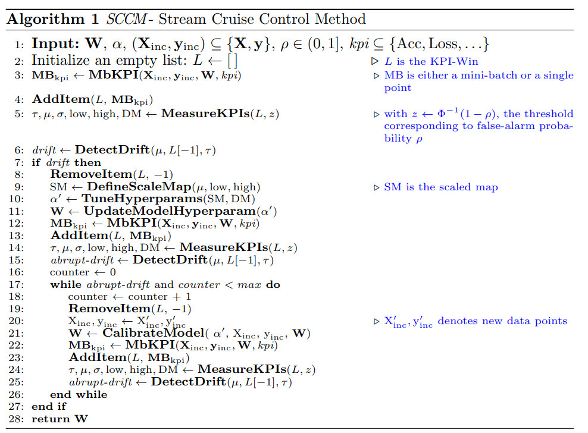
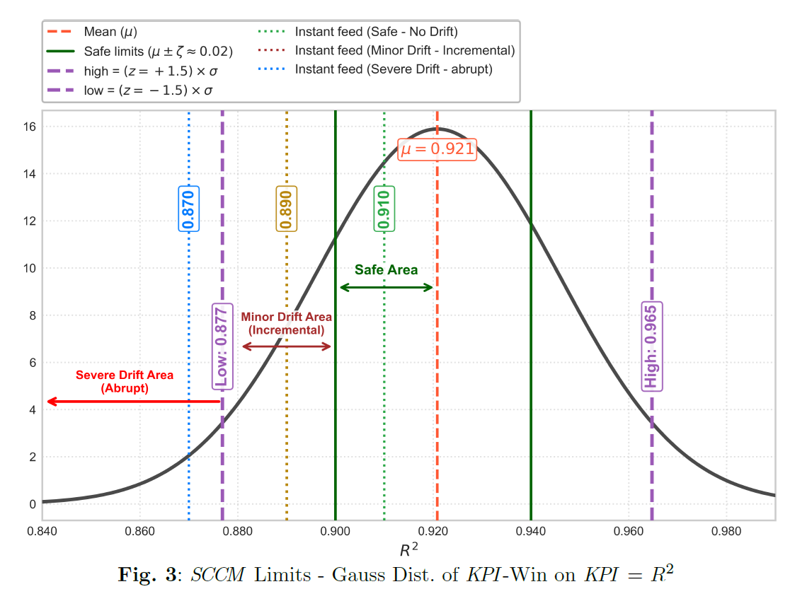
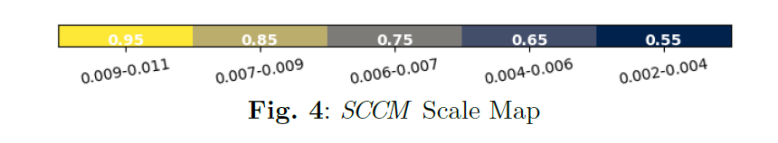
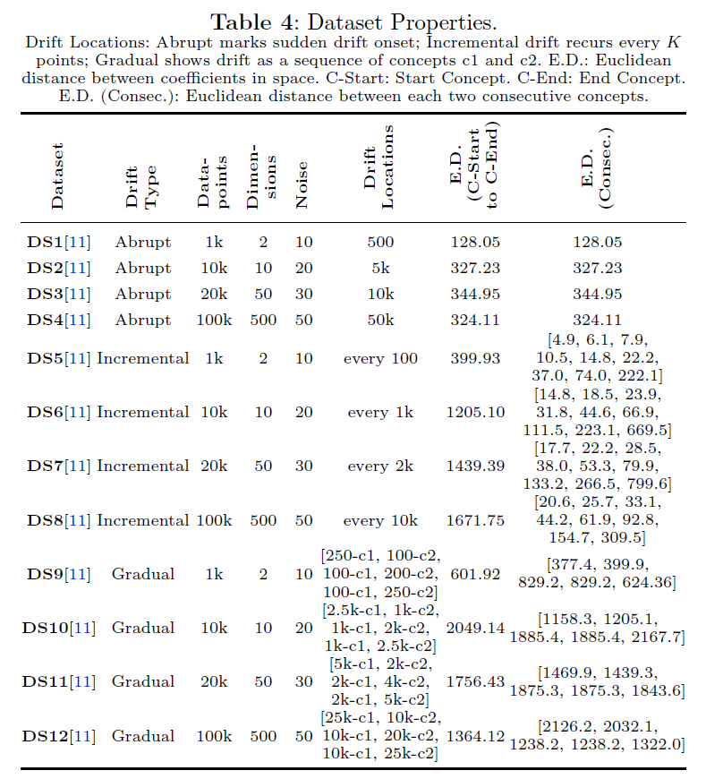
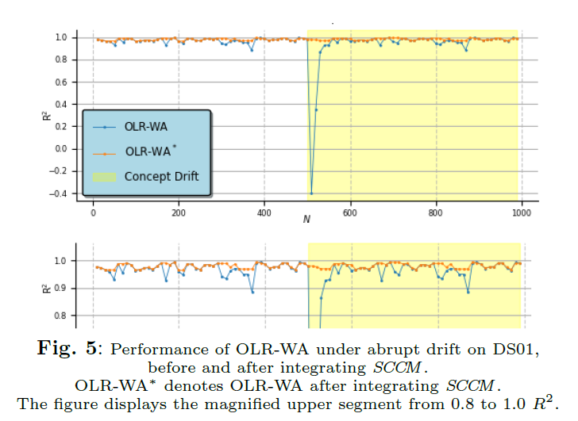
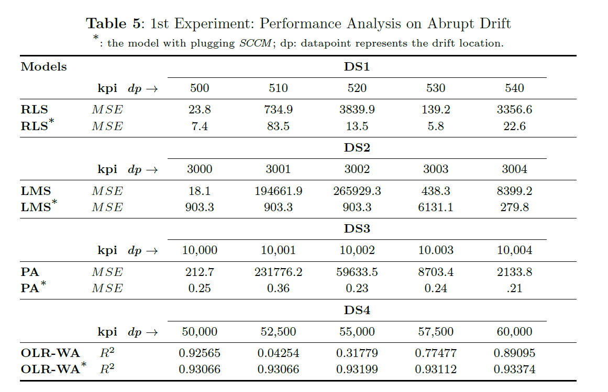
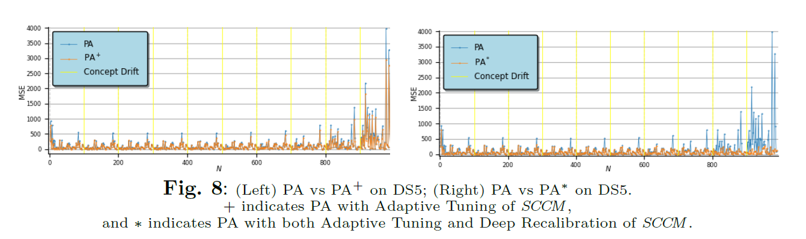
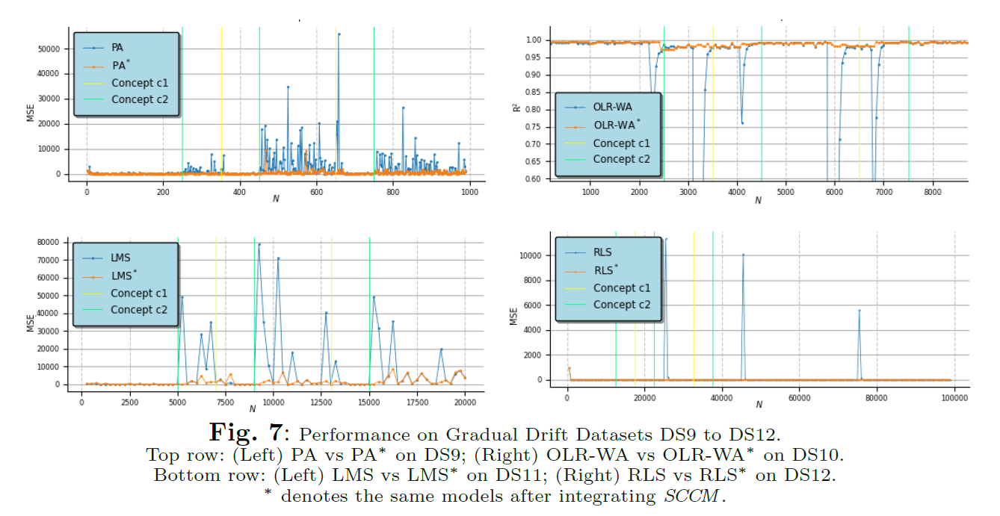
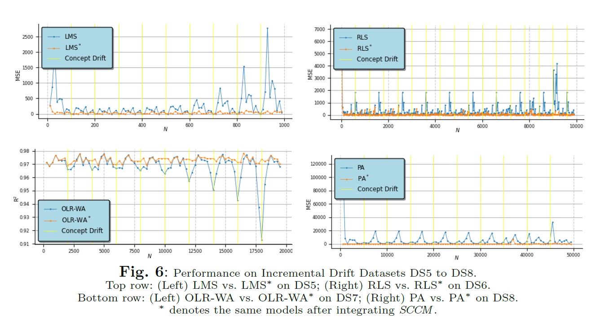

## SCCM: Stream Cruise Control Method for Automated Drift Detection and Adaptation in Online Regression
SCCM is an drift-aware adaptive framework designed for robust online regression under concept drift. 

**SCCM Objectives**

1. Proactive drift detection.
2. Quantification and categorization of drift magnitude.
3. Bounding of false-positive rates.
4. Adaptive hyperparameter tuning.
5. Deep recalibration when required to address persistent abrupt drifts.

**Contributions:**
This work introduces SCCM, an online regression-oriented framework for automated drift detection and adaptation. SCCM integrates:

**(i) proactive drift detection,**

**(ii) drift magnitude quantification,** 

**(iii) explicit false-positive management through thresholds bounded by a user-defined probability $\rho$ and a safe band,** 

**(iv) adaptive hyperparameter tuning, and** 

**(v) a two-level calibration process consisting of lightweight updates of the tuned hyperparameters and deeper recalibration using a few additional points. 
The framework is distribution-agnostic, \kpi-driven, and its in-memory design enables proactive intervention before model performance degradation occurs, and employs a dynamic thresholding strategy that ensures robustness across varying \kpis and diverse data stream characteristics, ensuring a versatile and resource-efficient solution for real-time regression tasks.** 

## Algorithm

## Method

## Datasets

## Experiments
### Abrupt Drift

### Automated Tuning vs Deep Recalibration

### Gradual Drift

### Incremental Drift

